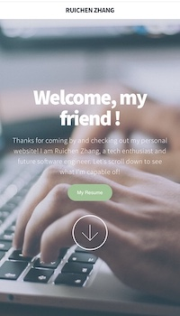

## Personal Portfolio

### Intro

Check out my personal portfolio website at [ruichenzhang.com](https://ruichenzhang.com/). It was built on responsive HTML5 and CSS3 and can be viewed both on a mobile screen and a desktop.

Destop Preview:

Mobile Preview:

### Credits

This personal website was created and adapted based on the free template provided by [html5up.net](https://html5up.net/) (@ajlkn) under the CCA 3.0 license.

 <em>Ruichen Zhang</em>
  Mar 4, 2021

